# 여행하자(Let's Travel)

여행하자(Let's Travel) 여행지 추천 내배캠 아웃소싱 프로젝트

## <b>개발 일정</b>
2023.12.5 - 2023.12.11

## <b>팀원</b>

| 팀원  | Github | 블로그 |  
|-------|--------|-----|
| 김래준 | https://velog.io/@laejunkim | https://github.com/Laejun-Kim |
| 이고운 | https://velog.io/@leegu517 | https://github.com/gounlee0517 |
| 이예지 | https://velog.io/@yeahzzl | https://github.com/Yeahzzl |
| 임홍원 | https://velog.io/@h0ngwon | https://github.com/h0ngwon |
| 최수인 | https://lumpy-bolt-999.notion.site/2023-11-57bb44481edc4834af154ba0e31e2264 | https://github.com/Choi-Suin |

## <b>사용 기술 스택</b>
 

## 서버
 

## 사용 라이브러리
* sweetalert2
* react-toastify
* Google Maps API
* Youtube API

## <b>버전 관리</b>

## 협업툴

# 여행하자(Let's Travel) 페이지 소개

## 메인페이지
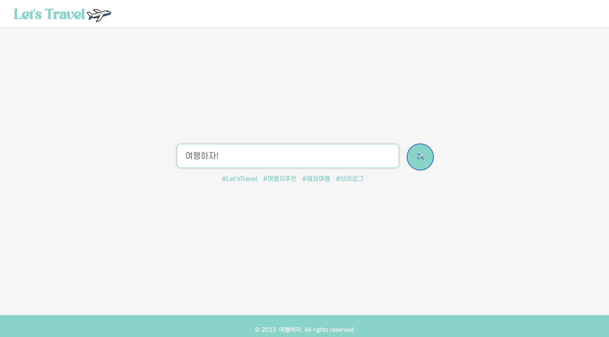

메인페이지에서 동그란 비행기 클릭시 로그인 할 수 있다.

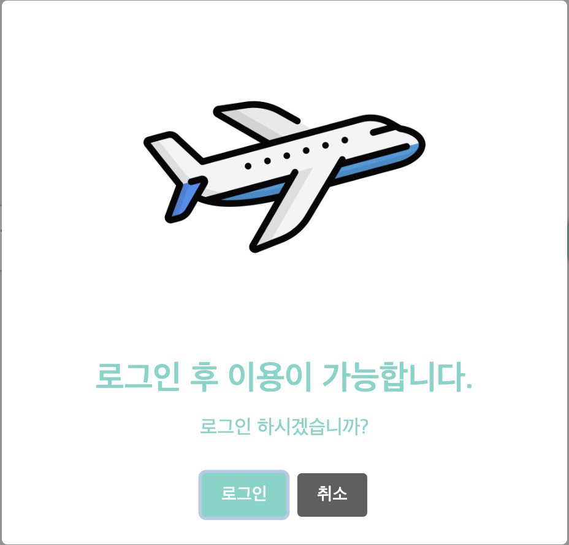

여행하자(Let's Travel)은 로그인 후 이용이 가능하다.

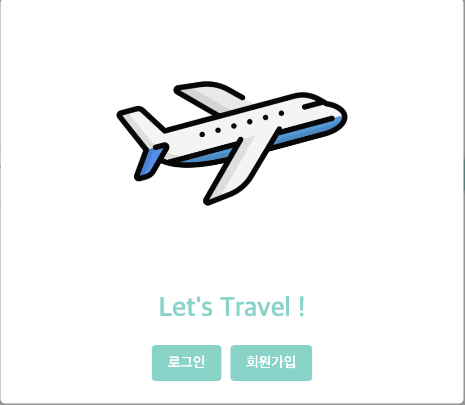
로그인과 회원가입을 선택 할 수 있다.

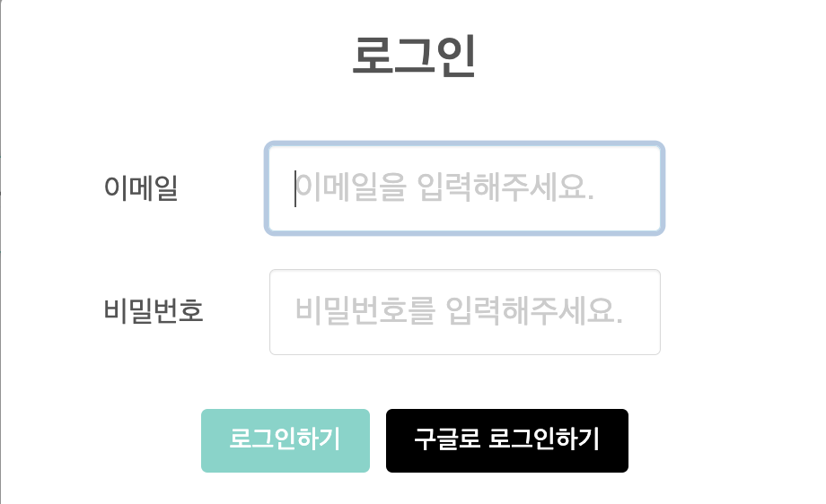
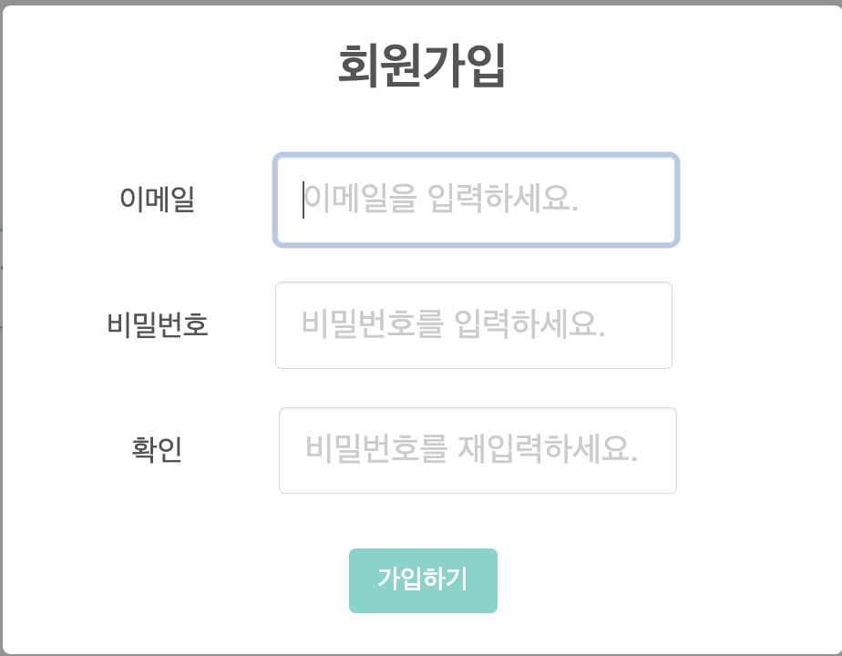
로그인과 회원가입 페이지

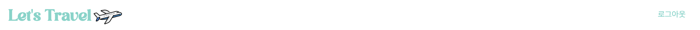
로그인 시 네비게이션바에 로그아웃이 생긴다.

## 설문조사 페이지
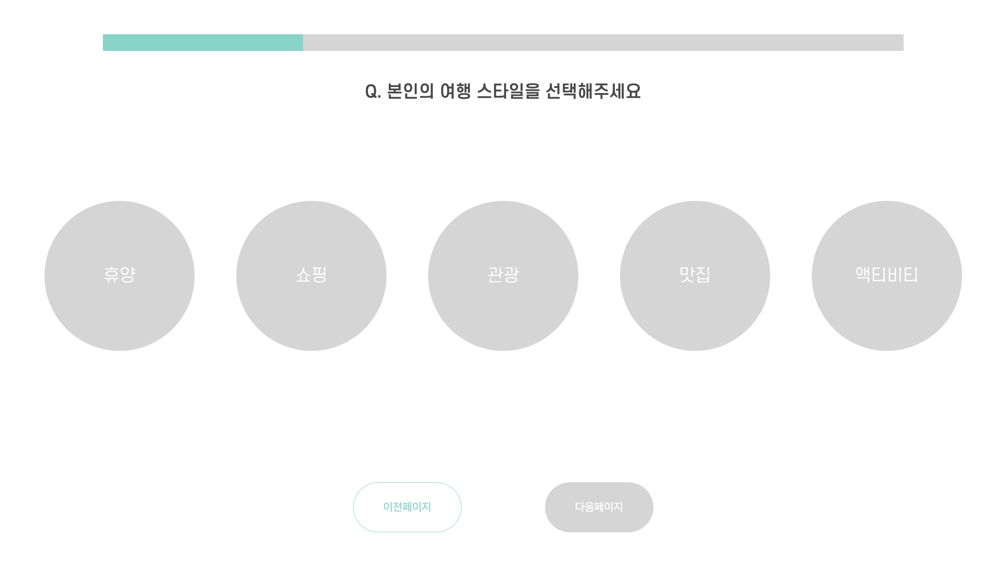
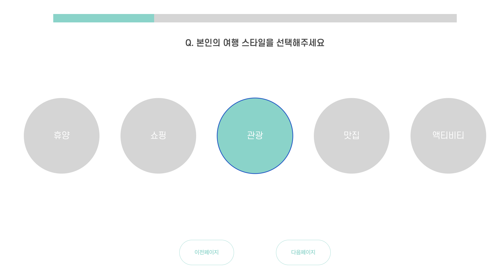
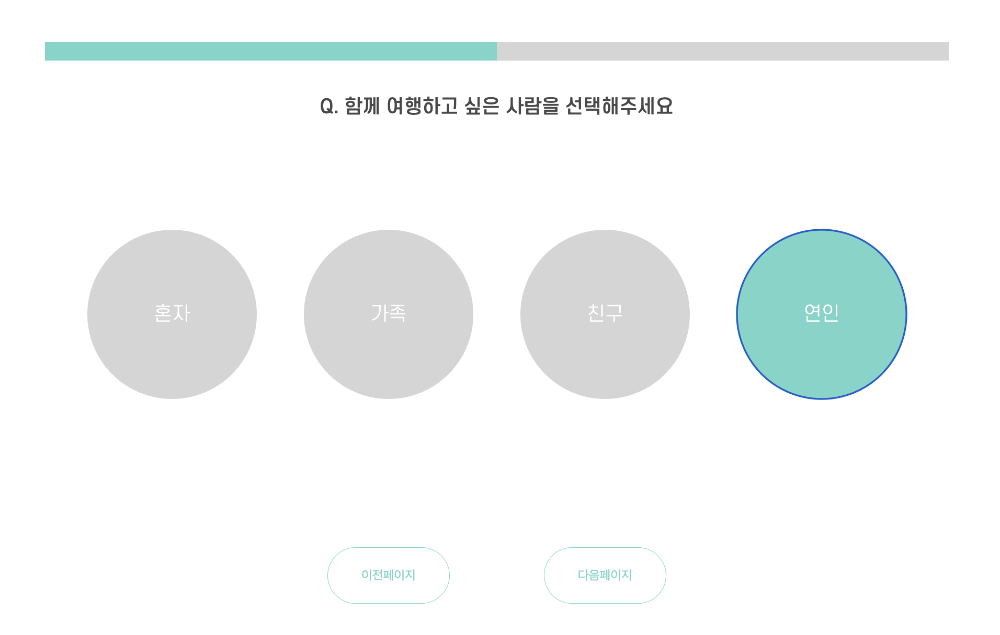
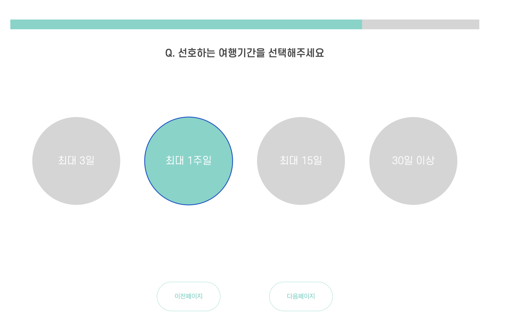
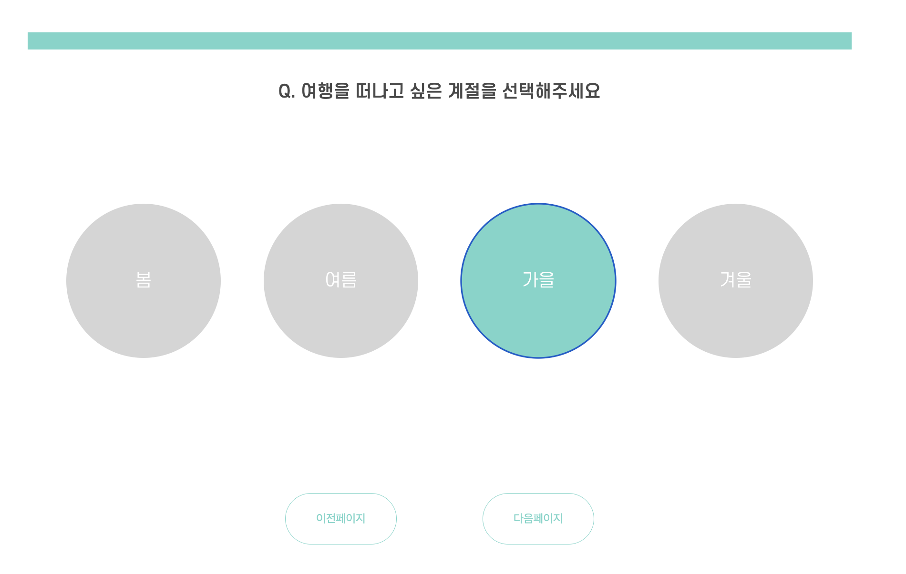
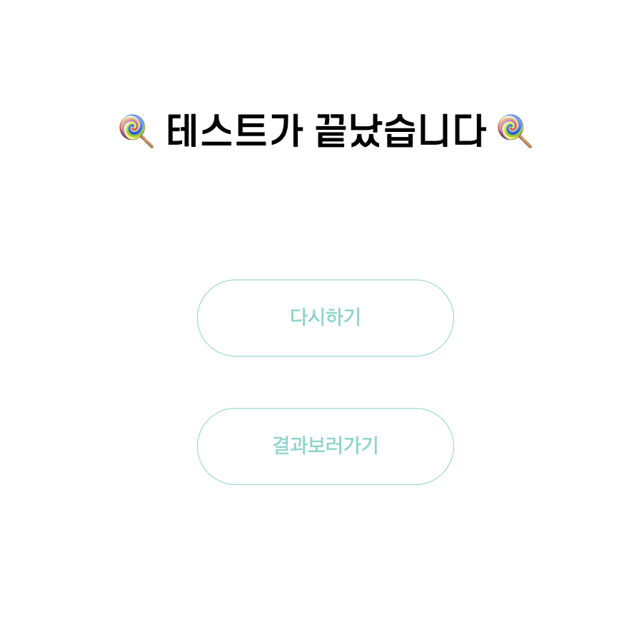
설문조사 페이지에서는 원하는 요소를 하나 선택하고 다음페이지로 넘어갈 수 있다. 
다시하기를 클릭하면 설문조사를 다시 할 수 있고
결과보러가기를 클릭하면 결과를 볼 수 있다. 

## 결과 페이지
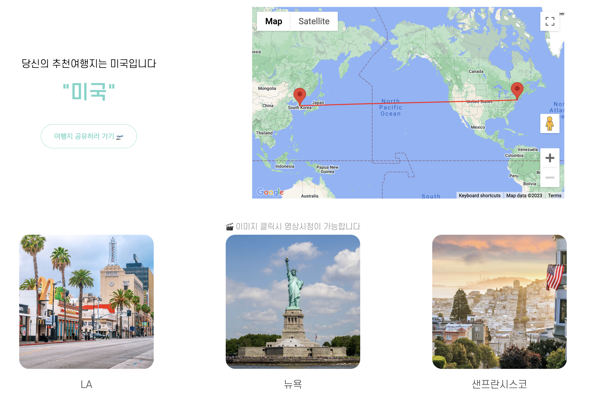

결과 페이지에선 설문조사 결과에 지도 사진을 확인할 수 있다. 
사진을 클릭할 시 유튜브 영상을 볼 수 있다. 

## 댓글 페이지
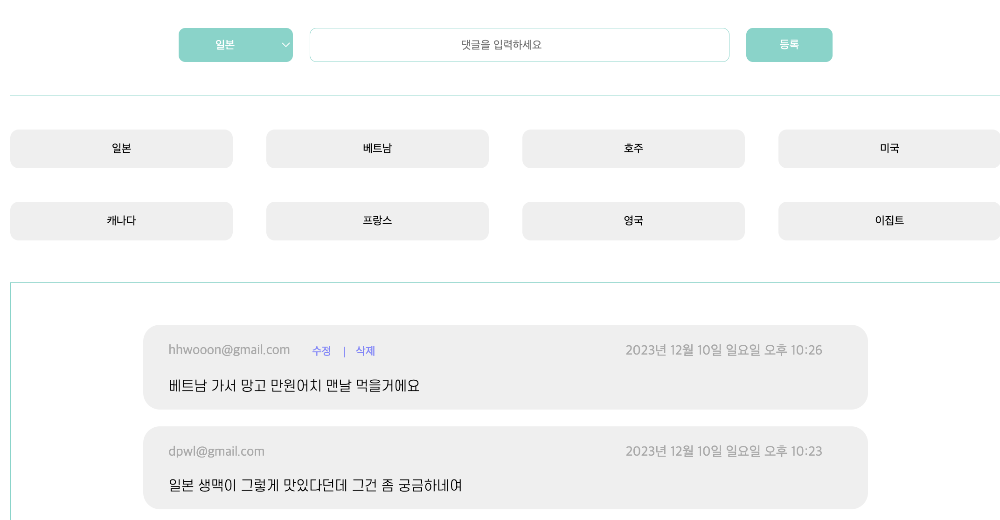
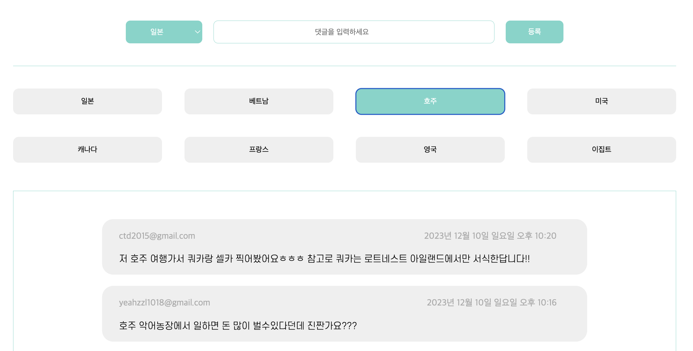
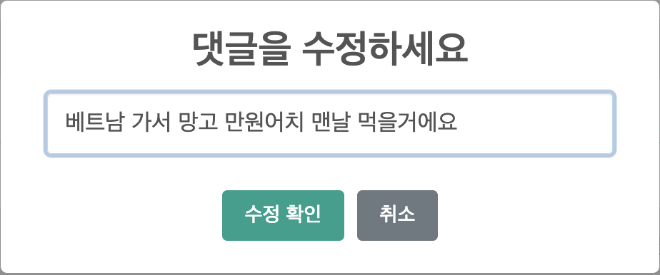

댓글 페이지에서는 나라별 댓글을 확인할 수 있고, 댓글의 수정과 삭제를 할 수 있다.